ANÁLISE DE SÉRIES TEMPORAIS
================
Ramon Lima de Oliveira Tavares

# Introdução

Neste documento, realizaremos atividades de sala de aula, modelando uma
série histórica dos preços do arroz em reais (R\$) e em dólares (US\$).
Vamos explorar os dados, realizar análises e visualizações para entender
melhor o comportamento desses preços ao longo do tempo.

``` r
# Carregar pacotes necessários
pacman::p_load("tidyverse","tseries","stats","patchwork","forecast","caTools", "readxl","zoo","grid")
```

``` r
# Ler o arquivo Excel
dadosArroz <- read_excel("C:/Users/tavar/Downloads/arroz.xlsx")

valorReais = as.numeric(dadosArroz$`À vista R$`)
valorDolar = as.numeric(dadosArroz$`À vista US$`)
data = as.Date(dadosArroz$Data)

dados<- data.frame(
  real = valorReais,
  dolar = valorDolar,
  data = data
)
```

``` r
# Agrupar por ano e mês, e calcular a média
dadosMensais <- dados %>%
  mutate(
    ano = year(data),
    mes = month(data)
  ) %>%
  group_by(ano, mes) %>%
  summarise(
    mediaMensalReais = mean(real, na.rm = TRUE),
    mediaMensalDolar = mean(dolar, na.rm = TRUE),
    .groups = "drop"
  )

# Criar a sequência de datas
datas <- seq(as.Date("2010-01-01"), as.Date("2022-08-01"), by = "month")

dadosMensais <- dadosMensais %>%
  mutate(data = datas) %>%
  select(-ano, -mes)
```

``` r
#Transformando os dados em séries temporais
tsReais <- ts(dadosMensais$mediaMensalReais,
              start = c(2010, 1),
              frequency = 12)
tsDolar <- ts(dadosMensais$mediaMensalDolar,
              start = c(2010, 1),
              frequency = 12)

# Decomposição Sazonal
decomposicaoReais <- stl(tsReais, s.window = "periodic")
decomposicaoDolar <- stl(tsDolar, s.window = "periodic")
```

``` r
decomposicaoSazonal<- function(dadosReais,dadosDolar, dadosOriginais){
  
  tendencia <- dadosReais$time.series[,"trend"]
  sazonalidade <- dadosReais$time.series[,"seasonal"]
  erro <- dadosReais$time.series[,"remainder"]
  
  dadosDecomposicao <- data.frame(
    data = dadosOriginais$data,
    tendencia = tendencia,
    sazonalidade = sazonalidade,
    erro = erro
  )
  
  graficoSerie <-dadosOriginais %>%
    ggplot(aes(x = data, y=mediaMensalReais)) +
    geom_line(color = "purple") +
    labs(title = "Série Temporal Preço Arroz [R$]",
         x = "Data", y = "Preço Arroz") +
    theme(axis.text = element_text(angle = 90, hjust = 1))+
    scale_x_date(date_breaks = "12 months", date_labels = "%Y-%m")
  
  ###############################################################################
  
  graficoTendencia <-dadosDecomposicao %>%
    ggplot(aes(x = data, y=tendencia)) +
    geom_line(color = "blue") +
    labs(title = "Componente de Tendência",
         x = "Data", y = "Tendência")
  
  ###############################################################################
  
  graficoSazonalidade <-dadosDecomposicao %>%
    ggplot(aes(x = data, y=sazonalidade)) +
    geom_line(color = "darkgreen") +
    labs(title = "Componente de Sazonalidade",
         x = "Data", y = "Sazonalidade")
  
  ###############################################################################
  
  graficoErro <-dadosDecomposicao %>%
    ggplot(aes(x = data, y=erro)) +
    geom_bar(stat = "identity", fill = "red") +
    labs(title = "Componente de Resíduos",
         x = "Data", y = "Resíduos")
  
  
  
  tendencia2 <- dadosDolar$time.series[,"trend"]
  sazonalidade2 <- dadosDolar$time.series[,"seasonal"]
  erro2 <- dadosDolar$time.series[,"remainder"]
  
  dadosDecomposicao2 <- data.frame(
    data = dadosOriginais$data,
    tendencia = tendencia2,
    sazonalidade = sazonalidade2,
    erro = erro2
  )
  
  graficoSerie2 <-dadosOriginais %>%
    ggplot(aes(x = data, y=mediaMensalDolar)) +
    geom_line(color = "purple") +
    labs(title = "Série Temporal Preço Arroz [US$]",
         x = "Data", y = "Preço Arroz") +
    theme(axis.text = element_text(angle = 90, hjust = 1))+
    scale_x_date(date_breaks = "12 months", date_labels = "%Y-%m")
  
  ###############################################################################
  
  graficoTendencia2 <-dadosDecomposicao2 %>%
    ggplot(aes(x = data, y=tendencia)) +
    geom_line(color = "blue") +
    labs(title = "Componente de Tendência",
         x = "Data", y = "Tendência")
  
  ###############################################################################
  
  graficoSazonalidade2 <-dadosDecomposicao2 %>%
    ggplot(aes(x = data, y=sazonalidade)) +
    geom_line(color = "darkgreen") +
    labs(title = "Componente de Sazonalidade",
         x = "Data", y = "Sazonalidade")
  
  ###############################################################################
  
  graficoErro2 <-dadosDecomposicao2 %>%
    ggplot(aes(x = data, y=erro)) +
    geom_bar(stat = "identity", fill = "red") +
    labs(title = "Componente de Resíduos",
         x = "Data", y = "Resíduos")
  
  vizualisarDecomposicao <- graficoSerie /graficoTendencia / graficoSazonalidade / graficoErro
  vizualisarDecomposicao2 <- graficoSerie2 /graficoTendencia2 / graficoSazonalidade2 / graficoErro2
  
  retorneLista <- list(
    graficoReal = vizualisarDecomposicao,
    graficoDolar = vizualisarDecomposicao2
  )
}
decompoFinal<-decomposicaoSazonal(decomposicaoReais,decomposicaoDolar,dadosMensais)
```

## DECOMPOSIÇÃO SAZONAL DA SÉRIE HISTÓRICA EM DÓLAR

``` r
# Salvar o boxplot como um arquivo de imagem
GGdecomposicaoDolar = decompoFinal$graficoDolar
ggsave("GGdecomposicaoDolar.png",decompoFinal$graficoDolar, width = 10, height = 8) 
print(GGdecomposicaoDolar)
```

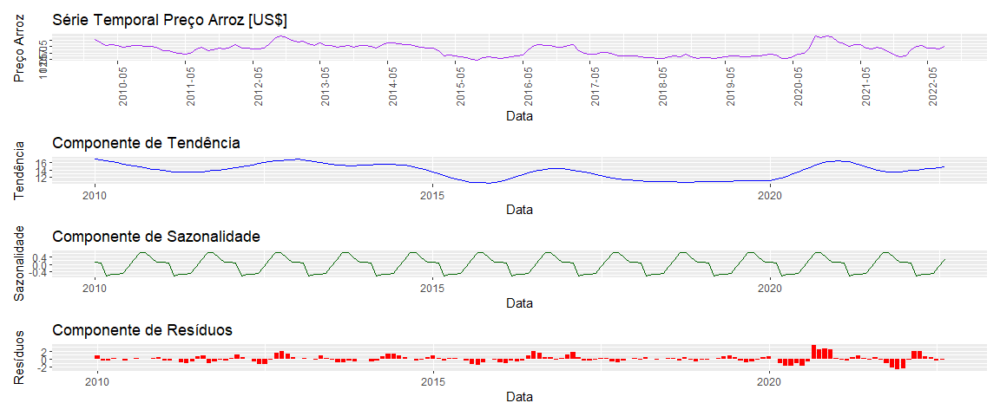<!-- -->

## DECOMPOSIÇÃO SAZONAL DA SÉRIE HISTÓRICA EM REAIS

``` r
# Salvar o boxplot como um arquivo de imagem
GGdecomposicaoReais = decompoFinal$graficoReal
ggsave("GGdecomposicaoReais.png",decompoFinal$graficoReal, width = 10, height = 8) 
print(GGdecomposicaoReais)
```

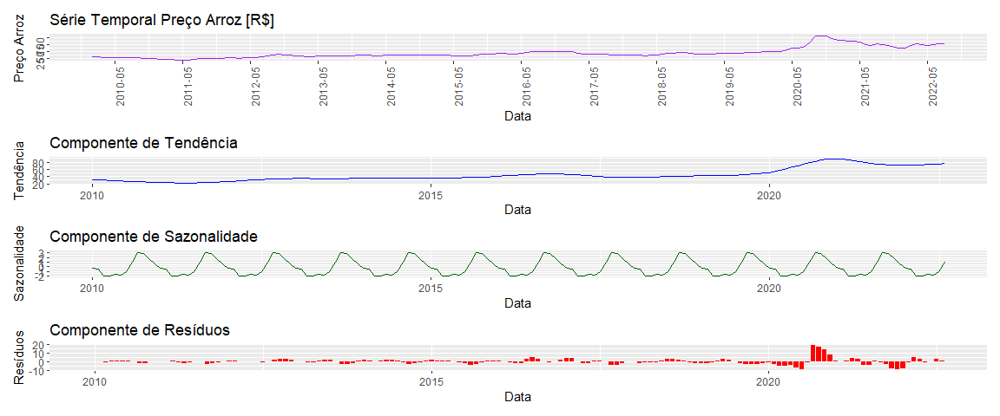<!-- -->

## FUNÇÃO DA ANÁLISE DESCRITIVA

``` r
graficosDescritiva <- function(dados){
  # Calcular os valores mínimos e máximos
  minimoDolar <- dados %>%
    filter(mediaMensalDolar == min(mediaMensalDolar))
  
  maximoDolar <- dados %>%
    filter(mediaMensalDolar == max(mediaMensalDolar))
  
  # Calcular os valores mínimos e máximos
  minimoReais <- dados %>%
    filter(mediaMensalReais == min(mediaMensalReais))
  
  maximoReais <- dados %>%
    filter(mediaMensalReais == max(mediaMensalReais))
  
  # Criar o gráfico
  graficoSerieReais <- dados %>%
    ggplot(aes(x = data, y = mediaMensalReais)) +
    geom_line(color = "blue") +
    geom_point(data = minimoReais, aes(x = data, y = mediaMensalReais), 
               color = "red", size = 3) +
    geom_point(data = maximoReais, aes(x = data, y = mediaMensalReais),
               color = "red", size = 3) +
    labs(title = "Série Temporal Preço Arroz [Reais]",
         x = "Data", y = "Preço Arroz") +
    theme(axis.text.x = element_text(angle = 90, hjust = 1)) +
    scale_x_date(date_breaks = "12 months", date_labels = "%Y-%m")
  
  # Criar o gráfico
  graficoSerieDolar <- dados %>%
    ggplot(aes(x = data, y = mediaMensalDolar)) +
    geom_line(color = "blue") +
    geom_point(data = minimoDolar, aes(x = data, y = mediaMensalDolar), 
               color = "red", size = 3) +
    geom_point(data = maximoDolar, aes(x = data, y = mediaMensalDolar),
               color = "red", size = 3) +
    labs(title = "Série Temporal Preço Arroz [Dólar]",
         x = "Data", y = "Preço Arroz") +
    theme(axis.text.x = element_text(angle = 90, hjust = 1)) +
    scale_x_date(date_breaks = "12 months", date_labels = "%Y-%m")
  
  listaGraficos = list(
    graficoReais = graficoSerieReais,
    graficoDolar = graficoSerieDolar
  )
  return(listaGraficos)
}
###############FUNÇÃO GRAFICO DA SERIE COM MARCAÇÕES DESCRITIVAS################
graficoSerieReais <- graficosDescritiva(dadosMensais)
graficoReais = graficoSerieReais$graficoDolar
graficoDolar = graficoSerieReais$graficoReais
################################################################################
ggsave("maxMinGraficos.png",graficoReais/graficoDolar, width = 10, height = 8) 
print(graficoReais/graficoDolar)
```

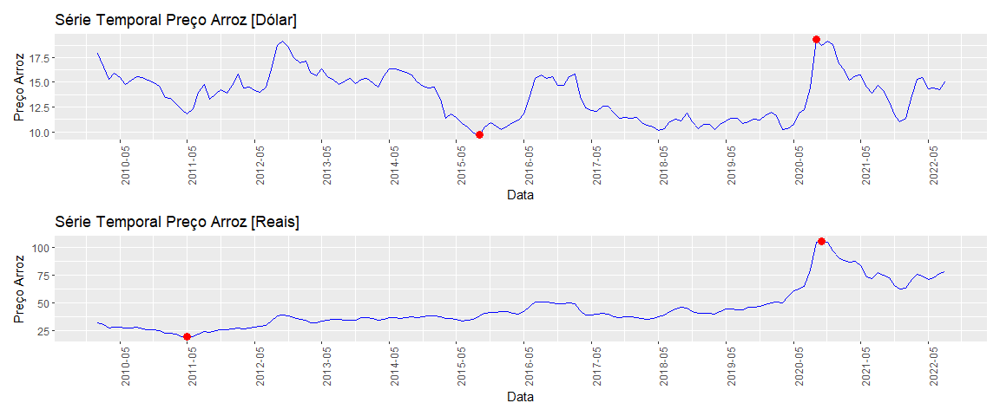<!-- -->

\##FUNÇÃO QUE GERA AS TABELAS DESCRITIVAS DA SÉRIE REAL E DOLAR

``` r
funcaoDescritiva <- function(dados){
  minimo = min(dados$mediaMensalReais)
  posicaoMinimo = which.min(dados$mediaMensalReais)
  mesMin = dados$data[posicaoMinimo]
  
  maximo = max(dados$mediaMensalReais)
  PosicaoMaximo = which.max(dados$mediaMensalReais)
  mesMax = dados$data[PosicaoMaximo]
  media =  (mean(dados$mediaMensalReais))
  nomesLinhas = c("Valor Máximo","Valor Mínimo","Valor Médio")
  
  dadosDescritiva = data.frame(
    valores = c(round(maximo,2),round(minimo,2),round(media,2)),
    datas = c(as.character(mesMax), as.character(mesMin), "---------")
  )
  
  minimo2 = min(dados$mediaMensalDolar)
  posicaoMinimo2 = which.min(dados$mediaMensalDolar)
  mesMin2 = dados$data[posicaoMinimo2]
  
  maximo2 = max(dados$mediaMensalDolar)
  PosicaoMaximo2 = which.max(dados$mediaMensalDolar)
  mesMax2 = dados$data[PosicaoMaximo2]
  media2 =  (mean(dados$mediaMensalDolar))
  nomesLinhas2 = c("Valor Máximo","Valor Mínimo","Valor Médio")
  
  dadosDescritivaDolares = data.frame(
    valores = c(round(maximo2,2),round(minimo2,2),round(media2,2)),
    datas = c(as.character(mesMax2), as.character(mesMin2), "---------")
  )
  rownames(dadosDescritiva) <- nomesLinhas
  rownames(dadosDescritivaDolares) <- nomesLinhas
  retorneLista = list(
    descritivaReais = dadosDescritiva,
    descritivaDolares = dadosDescritivaDolares
  )
  return(retorneLista)
}
############FUNÇÃO QUE GERA AS TABELAS DESCRITIVAS DA SÉRIE REAL E DOLAR########
descritiva <- funcaoDescritiva(dadosMensais)
descritivaReais = descritiva$descritivaReais
descritivaDolares = descritiva$descritivaDolares
print(descritivaDolares)
```

    ##              valores      datas
    ## Valor Máximo   19.33 2020-09-01
    ## Valor Mínimo    9.66 2015-09-01
    ## Valor Médio    13.68  ---------

``` r
print(descritivaReais)
```

    ##              valores      datas
    ## Valor Máximo  105.38 2020-10-01
    ## Valor Mínimo   19.08 2011-05-01
    ## Valor Médio    44.02  ---------

``` r
################################################################################
```

## TESTE DE ESTACIONARIEDADE

``` r
funcaoADF <- function(serie){
  testeAdf <- adf.test(serie)
  pValor = testeAdf$p.value
  resposta <- if(pValor<0.05){
    paste("A série é estacionária. P-valor = ",round(pValor,4)," é menor que o nível de significância de 5%, logo, aceitamos  a hipótese alternativa de que a série é estacionária.")
  }else{
    paste("A série não é estacionária. P-valor = ",round(pValor,4)," é maior que o nível de significância de 5%, logo, aceitamos a hipótese nula de que a série não é estacionária.")
  }
  retorneLista <- list(
    resposta =  resposta,
    pValor = pValor,
    hipotese = testeAdf$alternative
  )
  
  return(retorneLista)
}
########FUNÇÃO QUE GERA O RESULTADO DO TESTE DE ESTACIONARIEDADE################
testeAdfReais <- funcaoADF(dadosMensais$mediaMensalReais)
testeAdfDolar <- funcaoADF(dadosMensais$mediaMensalDolar)
print(testeAdfReais$resposta)
```

    ## [1] "A série não é estacionária. P-valor =  0.1764  é maior que o nível de significância de 5%, logo, aceitamos a hipótese nula de que a série não é estacionária."

``` r
print(testeAdfDolar$resposta)
```

    ## [1] "A série não é estacionária. P-valor =  0.2739  é maior que o nível de significância de 5%, logo, aceitamos a hipótese nula de que a série não é estacionária."

``` r
################################################################################
```

## DIFERENCIANDO OS DADOS PARA QUE SE POSSA OBTER A ESTACIONARIEDADE

``` r
#DATAFRAME PARA RECEBER OS DADOS DIFERENCIADOS 
dadosNovosDiferenciados  <- dadosMensais %>%
  mutate(
    dadosDiferenciadosReais = c(NA,diff(mediaMensalReais)),
    dadosDiferenciadosDolar = c(NA,diff(mediaMensalDolar))
    
  )
dadosNovosDiferenciados
```

    ## # A tibble: 152 × 5
    ##    mediaMensalReais mediaMensalDolar data       dadosDiferenciadosReais
    ##               <dbl>            <dbl> <date>                       <dbl>
    ##  1             32.0             18.0 2010-01-01                  NA    
    ##  2             30.4             16.5 2010-02-01                  -1.62 
    ##  3             27.4             15.3 2010-03-01                  -3.04 
    ##  4             28.0             15.9 2010-04-01                   0.654
    ##  5             28.2             15.5 2010-05-01                   0.125
    ##  6             26.7             14.8 2010-06-01                  -1.44 
    ##  7             26.9             15.2 2010-07-01                   0.208
    ##  8             27.4             15.6 2010-08-01                   0.473
    ##  9             26.5             15.4 2010-09-01                  -0.872
    ## 10             25.7             15.2 2010-10-01                  -0.858
    ## # ℹ 142 more rows
    ## # ℹ 1 more variable: dadosDiferenciadosDolar <dbl>

``` r
##REMOÇÃO DA PRIMEIRA LINHA DEPOIS DA DIFERENCIAÇÃO PARA MANTER OS DADOS NORMAIS
dadosNovosDiferenciadosSemNA <- dadosNovosDiferenciados[-1,]
print(dadosNovosDiferenciadosSemNA)
```

    ## # A tibble: 151 × 5
    ##    mediaMensalReais mediaMensalDolar data       dadosDiferenciadosReais
    ##               <dbl>            <dbl> <date>                       <dbl>
    ##  1             30.4             16.5 2010-02-01                 -1.62  
    ##  2             27.4             15.3 2010-03-01                 -3.04  
    ##  3             28.0             15.9 2010-04-01                  0.654 
    ##  4             28.2             15.5 2010-05-01                  0.125 
    ##  5             26.7             14.8 2010-06-01                 -1.44  
    ##  6             26.9             15.2 2010-07-01                  0.208 
    ##  7             27.4             15.6 2010-08-01                  0.473 
    ##  8             26.5             15.4 2010-09-01                 -0.872 
    ##  9             25.7             15.2 2010-10-01                 -0.858 
    ## 10             25.6             14.9 2010-11-01                 -0.0465
    ## # ℹ 141 more rows
    ## # ℹ 1 more variable: dadosDiferenciadosDolar <dbl>

## VERIFICANDO A ESTACIONARIEDADE NOS DADOS DIFERENCIADOS

``` r
##########Verificação de estacionariedade após a diferenciação##################
verificacaoEstacionariedadeReais <-suppressWarnings(
  funcaoADF(dadosNovosDiferenciadosSemNA$dadosDiferenciadosReais)
)
verificacaoEstacionariedadeReais$resposta
```

    ## [1] "A série é estacionária. P-valor =  0.01  é menor que o nível de significância de 5%, logo, aceitamos  a hipótese alternativa de que a série é estacionária."

``` r
verificacaoEstacionariedadeDolar <-suppressWarnings(
  funcaoADF(dadosNovosDiferenciadosSemNA$dadosDiferenciadosDolar)
)
print(verificacaoEstacionariedadeDolar$resposta)
```

    ## [1] "A série é estacionária. P-valor =  0.01  é menor que o nível de significância de 5%, logo, aceitamos  a hipótese alternativa de que a série é estacionária."

``` r
################################################################################
```

## VISUALIZAÇÃO GRÁFICA DOS DADOS DIFERENCIADOS

``` r
######FUNÇÃO PARA GERAR GRÁFICOS COM OS DADOS DIFERENCIADOS#####################
graficosEstacionarios <- function(dados){
  
  graficoEstacionarioReais <- dadosNovosDiferenciadosSemNA %>%
    ggplot(aes(x=data, y=dadosDiferenciadosReais)) +
    geom_line(color="darkblue") +
    labs(title = "Série temporal referente ao preço do arroz [REAIS]",
         x = "Lags Mensais", y = "Preços do arroz em escala diferenciada") +
    annotate("text", x = as.Date("2010-02-01"), y = 20,
             label = paste("p-valor do teste ADF = ",
                           verificacaoEstacionariedadeReais$pValor,
                           verificacaoEstacionariedadeReais$hipotese),
             hjust = 0, vjust = 1, color = "purple")
  
  graficoEstacionarioDolar <- dados %>%
    ggplot(aes(x=data, y=dadosDiferenciadosDolar)) +
    geom_line(color="darkblue") +
    labs(title = "Série temporal referente ao preço do arroz [DÓLAR]",
         x = "Lags Mensais", y = "Preços do arroz em escala diferenciada") +
    annotate("text", x = as.Date("2010-02-01"), y =5,
             label = paste("p-valor do teste ADF = ",
                           verificacaoEstacionariedadeDolar$pValor,
                           verificacaoEstacionariedadeDolar$hipotese),
             hjust = 0, vjust = 1, color = "purple")
  
  retorneGraficos = list(
    graficoEstacionarioReais = graficoEstacionarioReais,
    graficoEstacionarioDolar = graficoEstacionarioDolar
  )
  return(retorneGraficos)
  
}
graficosEstacionarios <-graficosEstacionarios(dadosNovosDiferenciadosSemNA)
graficoEstacionarioDolar <- graficosEstacionarios$graficoEstacionarioDolar
graficoEstacionarioReais <- graficosEstacionarios$graficoEstacionarioReais
ggsave("graficosEstacionarios.png",graficoEstacionarioDolar/graficoEstacionarioReais, width = 10, height = 8) 
print(graficoEstacionarioDolar/graficoEstacionarioReais)
```

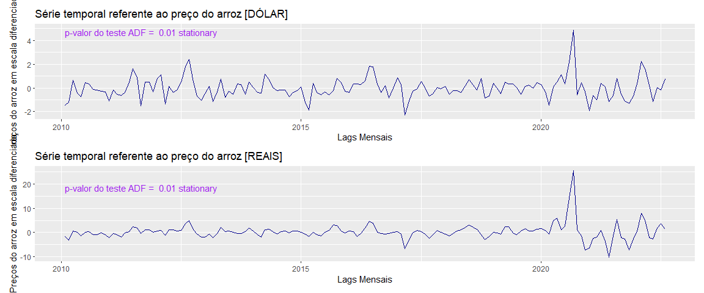<!-- -->

## TREINO E TESTE (VALIDAÇÃO CRUZADA)

``` r
#DIVISÃO TREINO E TESTE (VALIDAÇÃO CRUZADA DÓLAR)
funcaoTreinoTeste <- function(dados){
  
  #CRIAÇÃO DA SÉRIE TEMPORAL DIFERENCIADA REAIS
  serieTemporalDiferenciada <- ts(
    dados$dadosDiferenciadosReais,
    frequency = 12)
  
  serieTemporalDiferenciadaDolar <- ts(
    dados$dadosDiferenciadosDolar,
    frequency = 12)
  
  tamanhoSerie <-length(serieTemporalDiferenciada)
  janelaPrevisao = 12
  
  dadosTreino <- serieTemporalDiferenciada[1:(tamanhoSerie-janelaPrevisao)]
  dadosTeste <- serieTemporalDiferenciada[(tamanhoSerie-janelaPrevisao+1):tamanhoSerie]
  
  dadosTreinoDolar <- serieTemporalDiferenciadaDolar[1:(tamanhoSerie-janelaPrevisao)]
  dadosTesteDolar <- serieTemporalDiferenciadaDolar[(tamanhoSerie-janelaPrevisao+1):tamanhoSerie]
  
  totalLagsTreino <- length(dadosTreino)
  totalLagsTeste <- length(dadosTeste)
  
  dfTreino <- data.frame(
    lags = rep(1:totalLagsTreino),
    valores = as.numeric(dadosTreino),
    data = seq(as.Date("2010-02-01"), by = "month", length.out = 139)
  )
  
  dfTeste <- data.frame(
    lags = rep((totalLagsTreino+1):(totalLagsTreino+totalLagsTeste)),
    valores = as.numeric(dadosTeste),
    data = seq(as.Date("2021-09-01"), by = "month", length.out = 12)
  )
  
  dfTreinoDolar <- data.frame(
    lags = rep(1:totalLagsTreino),
    valores = as.numeric(dadosTreinoDolar),
    data = seq(as.Date("2010-02-01"), by = "month", length.out = 139)
  )
  
  dfTesteDolar <- data.frame(
    lags = rep((totalLagsTreino+1):(totalLagsTreino+totalLagsTeste)),
    valores = as.numeric(dadosTesteDolar),
    data = seq(as.Date("2021-09-01"), by = "month", length.out = 12)
  )
  
  # Determinar as datas de início e fim dos conjuntos de treino e teste
  data_inicio_treino <- min(dfTreino$data)
  data_fim_treino <- max(dfTreino$data)
  data_inicio_teste <- min(dfTeste$data)
  data_fim_teste <- max(dfTeste$data)
  
  # Marcar os pontos de início e fim
  pontos_marcar <- data.frame(
    lags = c(min(dfTreino$lags), max(dfTreino$lags), min(dfTeste$lags), max(dfTeste$lags)),
    valores = c(dfTreino$valores[1], dfTreino$valores[nrow(dfTreino)], dfTeste$valores[1], dfTeste$valores[nrow(dfTeste)]),
    labels = c(paste("", format(data_inicio_treino, "%b %Y")),
               paste("", format(data_fim_treino, "%b %Y")),
               paste("", format(data_inicio_teste, "%b %Y")),
               paste("", format(data_fim_teste, "%b %Y")))
  )
  
  # Criar o gráfico
  graficoTreinoTesteReais <- ggplot() +
    geom_line(data = dfTreino, aes(x = lags, y = valores, color = "Treino")) +
    geom_line(data = dfTeste, aes(x = lags, y = valores, color = "Teste")) +
    geom_point(data = pontos_marcar, aes(x = lags, y = valores), color = "darkgreen", size = 3) +
    geom_text(data = pontos_marcar, aes(x = lags, y = valores, label = labels),
              hjust = 0.5,
              vjust = -1, color = "black") +
    labs(title = "Conjuntos de Treino e Teste [REAIS]",
         x = "Lags Mensais", y = "Valor diferenciado para ajuste") +
    scale_color_manual(values = c("Treino" = "blue", "Teste" = "red"), name = "") +
    theme_minimal()
  
  
  # Determinar as datas de início e fim dos conjuntos de treino e teste
  data_inicio_treino2 <- min(dfTreinoDolar$data)
  data_fim_treino2 <- max(dfTreinoDolar$data)
  data_inicio_teste2 <- min(dfTesteDolar$data)
  data_fim_teste2 <- max(dfTesteDolar$data)
  
  # Marcar os pontos de início e fim
  pontos_marcar2 <- data.frame(
    lags = c(min(dfTreinoDolar$lags), max(dfTreinoDolar$lags), min(dfTesteDolar$lags), max(dfTesteDolar$lags)),
    valores = c(dfTreinoDolar$valores[1], dfTreinoDolar$valores[nrow(dfTreinoDolar)], dfTesteDolar$valores[1], dfTesteDolar$valores[nrow(dfTesteDolar)]),
    labels = c(paste("", format(data_inicio_treino2, "%b %Y")),
               paste("", format(data_fim_treino2, "%b %Y")),
               paste("", format(data_inicio_teste2, "%b %Y")),
               paste("", format(data_fim_teste2, "%b %Y")))
  )
  # Criar o gráfico
  graficoTreinoTesteDolares <- ggplot() +
    geom_line(data = dfTreinoDolar, aes(x = lags, y = valores, color = "Treino")) +
    geom_line(data = dfTesteDolar, aes(x = lags, y = valores, color = "Teste")) +
    geom_point(data = pontos_marcar2, aes(x = lags, y = valores), color = "darkgreen", size = 3) +
    geom_text(data = pontos_marcar2, aes(x = lags, y = valores, label = labels),
              hjust = 0.5,
              vjust = -1, color = "black") +
    labs(title = "Conjuntos de Treino e Teste [DÓLAR]",
         x = "Lags Mensais", y = "Valor diferenciado para ajuste") +
    scale_color_manual(values = c("Treino" = "blue", "Teste" = "red"), name = "") +
    theme_minimal()
  
  
  retorneGraficos = list(
    graficoReais = graficoTreinoTesteReais,
    graficoDolar =  graficoTreinoTesteDolares,
    diferenciadaReais = serieTemporalDiferenciada,
    diferenciadaDolar = serieTemporalDiferenciadaDolar,
    dadosTreinoReal = dadosTreino,
    dadosTreinoDolar = dadosTreinoDolar,
    totalLagsTreino = totalLagsTreino,
    totalLagsTeste = totalLagsTeste,
    dfTreino = dfTreino,
    dfTeste = dfTeste,
    dfTreinoDolar = dfTreinoDolar,
    dfTesteDolar = dfTesteDolar
  )
  return(retorneGraficos)
}
graficosTreinoTeste <- funcaoTreinoTeste(dadosNovosDiferenciadosSemNA)
graficoTreinoTesteReais <- graficosTreinoTeste$graficoReais
graficoTreinoTesteDolar <- graficosTreinoTeste$graficoDolar

ggsave("graficosTreinoTeste.png",graficoTreinoTesteReais/graficoTreinoTesteDolar, width = 10, height = 8) 
print(graficoTreinoTesteReais/graficoTreinoTesteDolar)
```

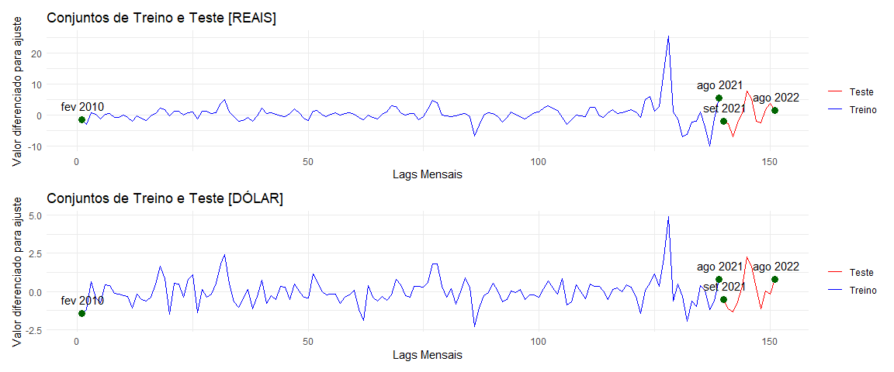<!-- -->

## MODELO SELECIONADO A PARTIR DO MODELO (AUTO.ARIMA) \[PREÇOS EM REAIS R\$\]

``` r
melhorModeloReais <- auto.arima(graficosTreinoTeste$diferenciadaReais)
summary(melhorModeloReais)
```

    ## Series: graficosTreinoTeste$diferenciadaReais 
    ## ARIMA(0,0,2) with zero mean 
    ## 
    ## Coefficients:
    ##          ma1     ma2
    ##       0.6527  0.1559
    ## s.e.  0.0821  0.0948
    ## 
    ## sigma^2 = 7.848:  log likelihood = -369.01
    ## AIC=744.03   AICc=744.19   BIC=753.08
    ## 
    ## Training set error measures:
    ##                     ME     RMSE      MAE       MPE     MAPE      MASE
    ## Training set 0.1688062 2.782731 1.567486 -39.75425 232.2951 0.5669523
    ##                      ACF1
    ## Training set -0.009491836

## MODELO SELECIONADO A PARTIR DO MODELO (AUTO.ARIMA) \[PREÇOS EM DÓLAR US\$\]

``` r
melhorModeloDolar <- auto.arima(graficosTreinoTeste$diferenciadaDolar)
summary(melhorModeloDolar)
```

    ## Series: graficosTreinoTeste$diferenciadaDolar 
    ## ARIMA(2,0,1) with zero mean 
    ## 
    ## Coefficients:
    ##           ar1     ar2     ma1
    ##       -0.3250  0.0542  0.7252
    ## s.e.   0.1768  0.1140  0.1553
    ## 
    ## sigma^2 = 0.6867:  log likelihood = -184.5
    ## AIC=377   AICc=377.27   BIC=389.07
    ## 
    ## Training set error measures:
    ##                       ME      RMSE       MAE      MPE     MAPE      MASE
    ## Training set -0.01210067 0.8203969 0.5935987 73.89806 157.8685 0.6386404
    ##                       ACF1
    ## Training set -0.0006106395

## MODELO ARIMA PARA OS DADOS COM PREÇOS EM REAIS R\$

``` r
modeloReais <- Arima(graficosTreinoTeste$dadosTreinoReal, order = c(0, 0, 2), seasonal = list(order = c(0, 0, 1), period = 12),include.mean = TRUE)
summary(modeloReais)
```

    ## Series: graficosTreinoTeste$dadosTreinoReal 
    ## ARIMA(0,0,2)(0,0,1)[12] with non-zero mean 
    ## 
    ## Coefficients:
    ##          ma1     ma2    sma1    mean
    ##       0.6683  0.1794  0.2058  0.3002
    ## s.e.  0.0815  0.1003  0.1068  0.4951
    ## 
    ## sigma^2 = 7.304:  log likelihood = -333.88
    ## AIC=677.76   AICc=678.21   BIC=692.43
    ## 
    ## Training set error measures:
    ##                      ME     RMSE      MAE      MPE     MAPE      MASE
    ## Training set 0.01101238 2.663352 1.469052 -22.5448 228.5908 0.8133324
    ##                     ACF1
    ## Training set 0.004895616

## MODELO ARIMA PARA OS DADOS COM PREÇOS EM DÓLAR US\$

``` r
modeloDolar <- Arima(graficosTreinoTeste$dadosTreinoDolar, order = c(2, 0, 1), seasonal = list(order = c(0, 0, 1), period = 12),include.mean = TRUE)
summary(modeloDolar)
```

    ## Series: graficosTreinoTeste$dadosTreinoDolar 
    ## ARIMA(2,0,1)(0,0,1)[12] with non-zero mean 
    ## 
    ## Coefficients:
    ##           ar1     ar2     ma1    sma1     mean
    ##       -0.4012  0.0600  0.7920  0.0610  -0.0248
    ## s.e.   0.1377  0.1056  0.1068  0.0939   0.0962
    ## 
    ## sigma^2 = 0.6713:  log likelihood = -167.16
    ## AIC=346.33   AICc=346.96   BIC=363.93
    ## 
    ## Training set error measures:
    ##                       ME      RMSE       MAE      MPE     MAPE      MASE
    ## Training set 0.002560184 0.8044518 0.5711866 71.93977 163.1547 0.7601717
    ##                      ACF1
    ## Training set -0.002866566

## A PARTIR DO MODELO CRIADO, PODEMOS VISUALIZAR A GENERALIZAÇÃO DA PREDIÇÃO PARA OS DADOS COM PREÇOS EM REAIS R\$

``` r
previsaoReais <- forecast(modeloReais, h = graficosTreinoTeste$totalLagsTeste)
plot(previsaoReais)
```

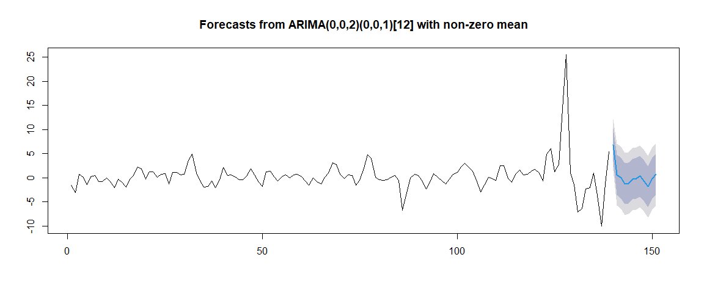<!-- -->

## A PARTIR DO MODELO CRIADO, PODEMOS VISUALIZAR A GENERALIZAÇÃO DA PREDIÇÃO PARA OS DADOS COM PREÇOS EM DÓLAR US\$

``` r
previsaoDolar <- forecast(modeloDolar, h = graficosTreinoTeste$totalLagsTeste)
plot(previsaoDolar)
```

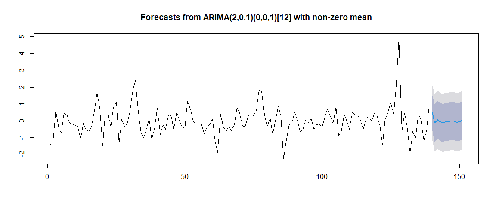<!-- -->

## UMA MANEIRA MAIS CUSTOMIZADA DE VISUALIZAR A PARTIR DO PACOTE GGPLOT COM OS INTERVALOS DE CONFIANÇA DO PACOTE FORECAST \[PARA OS DADOS EM REAIS R\$\]

``` r
inferiorReais <- as.numeric(previsaoReais$lower[,"95%"])
superiorReais <- as.numeric(previsaoReais$upper[,"95%"])

dadosReaisPrevistosRais <- data.frame(
  lags = rep((graficosTreinoTeste$totalLagsTreino+1):(graficosTreinoTeste$totalLagsTreino+graficosTreinoTeste$totalLagsTeste)),
  reais = as.numeric(graficosTreinoTeste$dfTeste$valores),
  previstos = previsaoReais$mean,
  inferior = inferiorReais,
  superior = superiorReais
)
print(dadosReaisPrevistosRais)
```

    ##    lags     reais   previstos  inferior  superior
    ## 1   140 -2.204978  6.79106735  1.494223 12.087912
    ## 2   141 -2.716476  0.61932295 -5.751562  6.990208
    ## 3   142 -7.096000 -0.09632307 -6.537692  6.345046
    ## 4   143 -2.694667 -1.28601690 -7.727386  5.155353
    ## 5   144  0.330000 -1.13596985 -7.577339  5.305400
    ## 6   145  7.818246 -0.28148687 -6.722856  6.159883
    ## 7   146  5.090239 -0.14566665 -6.587036  6.295703
    ## 8   147 -2.196555  0.26176065 -6.179609  6.703130
    ## 9   148 -2.654354 -0.76390849 -7.205278  5.677461
    ## 10  149  1.800519 -1.88592628 -8.327296  4.555443
    ## 11  150  3.694286 -0.15120405 -6.592573  6.290165
    ## 12  151  1.444286  0.74822298 -5.693146  7.189592

## UMA MANEIRA MAIS CUSTOMIZADA DE VISUALIZAR A PARTIR DO PACOTE GGPLOT COM OS INTERVALOS DE CONFIANÇA DO PACOTE FORECAST \[PARA OS DADOS EM DÓLAR US\$\]

``` r
inferiorDolar <- as.numeric(previsaoDolar$lower[,"95%"])
superiorDolar <- as.numeric(previsaoDolar$upper[,"95%"])

dadosReaisPrevistosDolar <- data.frame(
  lags = rep((graficosTreinoTeste$totalLagsTreino+1):(graficosTreinoTeste$totalLagsTreino+graficosTreinoTeste$totalLagsTeste)),
  reais = as.numeric(graficosTreinoTeste$dfTesteDolar$valores),
  previstos = previsaoDolar$mean,
  inferior = inferiorDolar,
  superior = superiorDolar
)
print(dadosReaisPrevistosDolar)
```

    ##    lags       reais    previstos  inferior superior
    ## 1   140 -0.52599567  0.536264060 -1.069579 2.142107
    ## 2   141 -1.11709524 -0.125642931 -1.849772 1.598486
    ## 3   142 -1.33500000  0.046126837 -1.684988 1.777242
    ## 4   143 -0.68361905 -0.066361877 -1.800364 1.667640
    ## 5   144  0.32952381 -0.132665772 -1.867373 1.602042
    ## 6   145  2.24441103 -0.066943337 -1.801843 1.667957
    ## 7   146  1.64822967 -0.075664494 -1.810616 1.659287
    ## 8   147  0.21808612 -0.001586267 -1.736551 1.733379
    ## 9   148 -1.14899522 -0.018963436 -1.753932 1.716005
    ## 10  149  0.05160173 -0.099472357 -1.834442 1.635497
    ## 11  150 -0.15619048 -0.063445578 -1.798416 1.671524
    ## 12  151  0.77095238  0.016516978 -1.718453 1.751487

**AGORA VAMOS DIAGNOSTICAR O MODELO PARA SABER SE OS DADOS ESTÃO
SEGUINDOS OS PRESSUPOSTOS DAS TÉCNICAS DE SÉRIES TEMPORAIS TÉCNICAS
ESSAS QUE SÃO AUTOCORRELAÇÃO NÃO SIGNIFICATICA, LAGS CORRELACIONADOS E
ESTACIONARIEDADE, OU SEJA, VARIÂNCIA EM TORNO DE ZERO. \[DIAGNÓSTICO DOS
PREÇOS EM REAIS\]**

``` r
diagnosticoReais <- tsdiag(modeloReais)
```

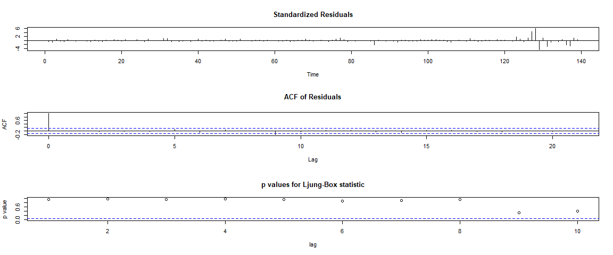<!-- -->

``` r
ggsave("diag1.png",diagnosticoReais, width = 10, height = 8) 
```

## \[DIAGNÓSTICO DOS PREÇOS EM DÓLAR\]

``` r
diagnosticoDolar <- tsdiag(modeloDolar)
```

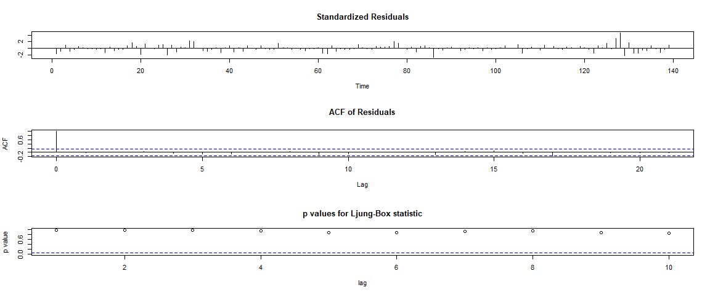<!-- -->

``` r
ggsave("diag1.png",diagnosticoReais, width = 10, height = 8) 
```

## PLOTANDO COM INTERVALOS DE CONFIANÇA

``` r
previsaoReais<- ggplot() +
  geom_line(data = graficosTreinoTeste$dfTreino, aes(x = lags, y = valores, color = "Treino")) +
  geom_point(data = graficosTreinoTeste$dfTeste, aes(x = lags, y = valores, color = "Reais")) +
  geom_point(data = dadosReaisPrevistosRais, aes(x = lags, y = previstos, color = "Previstos")) +
  geom_ribbon(data = dadosReaisPrevistosRais, aes(x = lags, ymin = inferior, ymax = superior), alpha = 0.3, fill = "green") +
  labs(title = "Série histórica do preço do arroz [REAIS] (jan de 2010 a Ago 2022)",
       x = "Lags Mensais", y = "Valores em escala Diferenciada") +
  scale_color_manual(values = c("Treino" = "purple", "Reais" = "blue", "Previstos" = "red"), name = "") +
  theme_minimal()

apenasPrevisoesReais<-ggplot() +
  geom_point(data = graficosTreinoTeste$dfTeste, aes(x = lags, y = valores, color = "Reais")) +
  geom_point(data = dadosReaisPrevistosRais, aes(x = lags, y = previstos, color = "Previstos")) +
  geom_ribbon(data = dadosReaisPrevistosRais, aes(x = lags, ymin = inferior, ymax = superior), alpha = 0.3, fill = "green") +
  labs(title = "Conjuntos de Treino, Teste e Previsões com Intervalo de Confiança",
       x = "Lags Mensais", y = "Valores em escala Diferenciada") +
  scale_color_manual(values = c("Reais" = "blue", "Previstos" = "red"), name = "") +
  theme_minimal()

# Plot com intervalo de confiança
previsaoDolar<- ggplot() +
  geom_line(data = graficosTreinoTeste$dfTreinoDolar, aes(x = lags, y = valores, color = "Treino")) +
  geom_point(data = graficosTreinoTeste$dfTesteDolar, aes(x = lags, y = valores, color = "Reais")) +
  geom_point(data = dadosReaisPrevistosDolar, aes(x = lags, y = previstos, color = "Previstos")) +
  geom_ribbon(data = dadosReaisPrevistosDolar, aes(x = lags, ymin = inferior, ymax = superior), alpha = 0.3, fill = "green") +
  labs(title = "Série histórica do preço do arroz [DOLAR] (jan de 2010 a Ago 2022)",
       x = "Lags Mensais", y = "Valores em escala Diferenciada") +
  scale_color_manual(values = c("Treino" = "purple", "Reais" = "blue", "Previstos" = "red"), name = "") +
  theme_minimal()

apenasPrevisaoDolar<- ggplot() +
  geom_point(data = graficosTreinoTeste$dfTesteDolar, aes(x = lags, y = valores, color = "Reais")) +
  geom_point(data = dadosReaisPrevistosDolar, aes(x = lags, y = previstos, color = "Previstos")) +
  geom_ribbon(data = dadosReaisPrevistosDolar, aes(x = lags, ymin = inferior, ymax = superior), alpha = 0.3, fill = "green") +
  labs(title = "Conjuntos de Treino, Teste e Previsões com Intervalo de Confiança",
       x = "Lags Mensais", y = "Valores em escala Diferenciada") +
  scale_color_manual(values = c("Reais" = "blue", "Previstos" = "red"), name = "") +
  theme_minimal()
```

**RETOMANDO OS VALORES DAS PREVISÕES PARA A ESCALA ORIGINAL A PARTIR DO
MÉTODO CUMSUM, OU SEJA, PEGAMOS A POSIÇÃO INICIAL E FINAL DOS DADOS QUE
UTILIZAMOS PARA TESTE E RETOMAMOS OS VALORES PARA A ESCALA ORIGINAL,
TANDO OS DADOS REAIS DO NOSSO BANCO DE DADOS QUANTO OS VALORES DAS
PREVISÕES, NISSO, PARA CONTESTAR QUE ESTAMOS REALIZANDO ESSA CONVERSÃO
DE FORMA EXTREMAMENTE CORRETA, BASTA COMPARARMOS OS QUE FORAM
DIFERENCIADOS RETOMADOS NA ESCALA ORIGINAL COM O BANCO DE DADOS REAL.**

## PREÇOS EM REAIS R\$ NA ESCALA ORIGINAL E PREDICOS PELO MODELO (ÚLTIMOS 12 LAGS DO BANCO DE DADOS ORIGINAL)

``` r
posicaoInicial<-dadosReaisPrevistosRais[1,1]
posicaoFinal <- tail(dadosReaisPrevistosRais$lags, 1)
dadosEscalaReal <- cumsum(dadosReaisPrevistosRais$reais) + dadosMensais$mediaMensalReais[posicaoInicial]
dadosPreditosEscalaReal <- cumsum(dadosReaisPrevistosRais$previstos) + dadosMensais$mediaMensalReais[posicaoInicial]

datas = seq(as.Date("2021-09-01"), by = "month", length.out = 12)

dadosEscalaReal <-data.frame(
  data = datas,
  reais = dadosEscalaReal,
  previstos = dadosPreditosEscalaReal
)
print(dadosEscalaReal)
```

    ##          data    reais previstos
    ## 1  2021-09-01 74.98048  83.97652
    ## 2  2021-10-01 72.26400  84.59584
    ## 3  2021-11-01 65.16800  84.49952
    ## 4  2021-12-01 62.47333  83.21350
    ## 5  2022-01-01 62.80333  82.07754
    ## 6  2022-02-01 70.62158  81.79605
    ## 7  2022-03-01 75.71182  81.65038
    ## 8  2022-04-01 73.51526  81.91214
    ## 9  2022-05-01 70.86091  81.14823
    ## 10 2022-06-01 72.66143  79.26231
    ## 11 2022-07-01 76.35571  79.11110
    ## 12 2022-08-01 77.80000  79.85933

## PREÇOS EM DÓLAR R\$ NA ESCALA ORIGINAL (ORIGINAIS E PREDITOS PELO MODELO)

``` r
dadosEscalaRealDolar <- cumsum(dadosReaisPrevistosDolar$reais) + dadosMensais$mediaMensalDolar[posicaoInicial]
dadosPreditosEscalaRealDolar <- cumsum(dadosReaisPrevistosDolar$previstos) + dadosMensais$mediaMensalDolar[posicaoInicial]

data2 = seq(as.Date("2021-09-01"), by = "month", length.out = 12)

dadosEscalaReal2 <-data.frame(
  data = data2,
  reais = dadosEscalaRealDolar,
  previstos = dadosPreditosEscalaRealDolar
)
print(dadosEscalaReal2)
```

    ##          data    reais previstos
    ## 1  2021-09-01 14.17810  15.24035
    ## 2  2021-10-01 13.06100  15.11471
    ## 3  2021-11-01 11.72600  15.16084
    ## 4  2021-12-01 11.04238  15.09448
    ## 5  2022-01-01 11.37190  14.96181
    ## 6  2022-02-01 13.61632  14.89487
    ## 7  2022-03-01 15.26455  14.81920
    ## 8  2022-04-01 15.48263  14.81762
    ## 9  2022-05-01 14.33364  14.79865
    ## 10 2022-06-01 14.38524  14.69918
    ## 11 2022-07-01 14.22905  14.63574
    ## 12 2022-08-01 15.00000  14.65225

``` r
#DATA FRAME COM ESCALA REAL

dadosEscalaRealDiffReal <- dadosEscalaReal %>%
  mutate(diff = reais - previstos)
```

## COLOCANDO AS PREVISÕES NA ESCALA ORIGINAL DOS DADOS ASSIM COMO FORAM RETORNADOS À ESCALA ORIGINAL OS DADOS REAIS REFERENTES AOS PREÇOS EM REAIS E EM DÓLAR

``` r
# Criar a sequência de datas
datasPrevisao <- seq(as.Date("2022-10-01"), as.Date("2023-09-01"), by = "month")

previsaoUmAnoReais<- forecast(modeloReais, h=12)
previsaoUmAnoDolar<- forecast(modeloDolar, h=12)

dadosPrevisoesFuturas<- data.frame(
  data = datasPrevisao,
  previsaoReais = previsaoUmAnoReais$mean,
  previsaoDolar = previsaoUmAnoDolar$mean
)

dadosEscalaRealReais <- cumsum(dadosPrevisoesFuturas$previsaoReais) + dadosMensais$mediaMensalReais[posicaoInicial]

dadosEscalaRealDolar <- cumsum(dadosPrevisoesFuturas$previsaoDolar) + dadosMensais$mediaMensalDolar[posicaoInicial]

dadosPrevisaoCompleta <- data.frame(
  data = datasPrevisao,
  previsaoDolar = dadosEscalaRealDolar,
  previsaoReais = dadosEscalaRealReais
)

print(dadosPrevisaoCompleta)
```

    ##          data previsaoDolar previsaoReais
    ## 1  2022-10-01      15.24035      83.97652
    ## 2  2022-11-01      15.11471      84.59584
    ## 3  2022-12-01      15.16084      84.49952
    ## 4  2023-01-01      15.09448      83.21350
    ## 5  2023-02-01      14.96181      82.07754
    ## 6  2023-03-01      14.89487      81.79605
    ## 7  2023-04-01      14.81920      81.65038
    ## 8  2023-05-01      14.81762      81.91214
    ## 9  2023-06-01      14.79865      81.14823
    ## 10 2023-07-01      14.69918      79.26231
    ## 11 2023-08-01      14.63574      79.11110
    ## 12 2023-09-01      14.65225      79.85933

## GRAFICO CUSTOMIZADO COM LINHAS E DIFERENÇAS ENTRE OS VALORES REAIS E PREVISTOS

``` r
graficoLigadoReais<- ggplot(data = dadosEscalaReal, aes(x = data)) +
  geom_point(aes(y = reais, color = "Reais"), size = 3) +
  geom_point(aes(y = previstos, color = "Previstos"), size = 3) +
  geom_segment(aes(x = data, y = reais, xend = data, yend = previstos), color = "black", alpha = 0.5) +
  geom_label(data = dadosEscalaRealDiffReal, aes(x = data, y = (reais + previstos) / 2, label = sprintf("%.2f", diff)), 
             hjust = -0.2, color = "black") +
  labs(title = "Valores Reais e Previstos [REAIS]",
       x = "Data", y = "Valor do arroz em R$") +
  scale_color_manual(values = c("blue", "red"), name = "", labels = c("Reais", "Previstos")) +
  theme_minimal()

dadosEscalaRealDiffDolar <- dadosEscalaReal2 %>%
  mutate(diff = reais - previstos)

# Gráfico com linhas e valores de diferença
graficoLigadoDolar<- ggplot(data = dadosEscalaReal2, aes(x = data)) +
  geom_point(aes(y = reais, color = "Reais"), size = 3) +
  geom_point(aes(y = previstos, color = "Previstos"), size = 3) +
  geom_segment(aes(x = data, y = reais, xend = data, yend = previstos), color = "black", alpha = 0.5) +
  geom_label(data = dadosEscalaRealDiffDolar, aes(x = data, y = (reais + previstos) / 2, label = sprintf("%.2f", diff)), 
             hjust = -0.2, color = "black") +
  labs(title = "Valores Reais e Previstos [DÓLAR]",
       x = "Data", y = "Valor do arroz em US$") +
  scale_color_manual(values = c("blue", "red"), name = "", labels = c("Reais", "Previstos")) +
  theme_minimal()
```

## MÉTRICAS DOS DADOS COM PREÇOS EM REAIS R\$

``` r
rmse <- sqrt(mean((dadosEscalaReal$reais - dadosEscalaReal$previstos)^2))
paste("RMSE",round(rmse))
```

    ## [1] "RMSE 12"

``` r
mae <- mean(abs(dadosEscalaReal$reais - dadosEscalaReal$previstos))
paste("MAE",round(mae))
```

    ## [1] "MAE 11"

``` r
mape <- mean(abs((dadosEscalaReal$reais - dadosEscalaReal$previstos) / dadosEscalaReal$reais)) * 100
paste("MAPE",round(mape,2),"%")
```

    ## [1] "MAPE 15.63 %"

## MÉTRICAS DOS DADOS COM PREÇOS EM DÓLAR US\$

``` r
rmse <- sqrt(mean((dadosEscalaReal2$reais - dadosEscalaReal2$previstos)^2))
paste("RMSE",round(rmse))
```

    ## [1] "RMSE 2"

``` r
mae <- mean(abs(dadosEscalaReal2$reais - dadosEscalaReal2$previstos))
paste("MAE",round(mae))
```

    ## [1] "MAE 2"

``` r
mape <- mean(abs((dadosEscalaReal2$reais - dadosEscalaReal2$previstos) / dadosEscalaReal$reais)) * 100
paste("MAPE",round(mape,2),"%")
```

    ## [1] "MAPE 2.26 %"

## VISUALIZAÇÃO TREINO TESTE E PREVISÕES DOS PREÇOS DO ARROZ EM REAIS R\$

``` r
ggsave("previsaoReaisFinalTreino.png",(previsaoReais+apenasPrevisoesReais)/graficoLigadoReais, width = 14, height = 8)
plot((previsaoReais+apenasPrevisoesReais)/graficoLigadoReais)
```

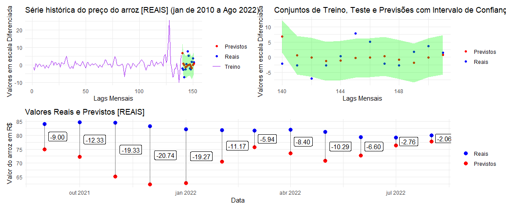<!-- -->

## VISUALIZAÇÃO TREINO TESTE E PREVISÕES DOS PREÇOS DO ARROZ EM DÓLAR R\$

``` r
ggsave("previsaoReaisFinalTreino.png",(previsaoDolar+apenasPrevisaoDolar)/graficoLigadoDolar, width = 14, height = 8)
print((previsaoDolar+apenasPrevisaoDolar)/graficoLigadoDolar)
```

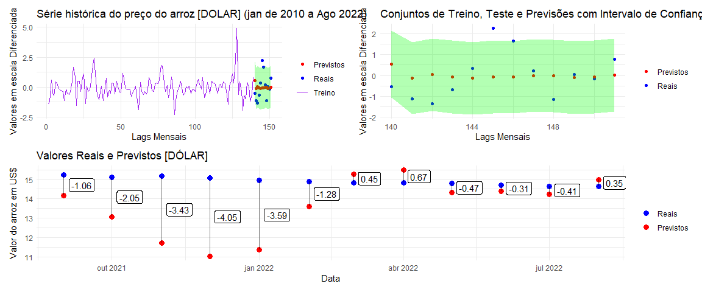<!-- -->

## REALIZANDO UMA PREVISÃO PARA 12 MESES A FRENTE A PARTIR DO MODELO BEM TREINADO

``` r
# Criar a sequência de datas
datasPrevisao <- seq(as.Date("2022-10-01"), as.Date("2023-09-01"), by = "month")


modeloReaisCompleto <- auto.arima(dadosMensais$mediaMensalReais)
summary(modeloReaisCompleto)
```

    ## Series: dadosMensais$mediaMensalReais 
    ## ARIMA(0,1,2) 
    ## 
    ## Coefficients:
    ##          ma1     ma2
    ##       0.6527  0.1559
    ## s.e.  0.0821  0.0948
    ## 
    ## sigma^2 = 7.848:  log likelihood = -369.01
    ## AIC=744.03   AICc=744.19   BIC=753.08
    ## 
    ## Training set error measures:
    ##                     ME     RMSE      MAE       MPE     MAPE      MASE
    ## Training set 0.1679063 2.773563 1.557384 0.3066633 3.216873 0.8503975
    ##                      ACF1
    ## Training set -0.009314057

``` r
#CRIAÇÃO DA SÉRIE TEMPORAL DIFERENCIADA REAIS
serieTemporalDiferenciadaReais <- ts(
  dadosMensais$mediaMensalReais,
  frequency = 12)

modeloReaisCompleto <- Arima(serieTemporalDiferenciadaReais, order = c(0, 1, 2), seasonal = list(order = c(0, 0, 1), period = 12),
                             include.mean = TRUE)
summary(modeloReaisCompleto)
```

    ## Series: serieTemporalDiferenciadaReais 
    ## ARIMA(0,1,2)(0,0,1)[12] 
    ## 
    ## Coefficients:
    ##          ma1     ma2     sma1
    ##       0.6543  0.1552  -0.0106
    ## s.e.  0.0831  0.0953   0.0822
    ## 
    ## sigma^2 = 7.899:  log likelihood = -369.01
    ## AIC=746.01   AICc=746.29   BIC=758.08
    ## 
    ## Training set error measures:
    ##                     ME     RMSE      MAE       MPE    MAPE      MASE
    ## Training set 0.1697298 2.773375 1.555594 0.3083535 3.21375 0.1584478
    ##                      ACF1
    ## Training set -0.009550744

``` r
modeloDolarCompleto <- auto.arima(dadosMensais$mediaMensalDolar)
summary(modeloDolarCompleto)
```

    ## Series: dadosMensais$mediaMensalDolar 
    ## ARIMA(2,1,1) 
    ## 
    ## Coefficients:
    ##           ar1     ar2     ma1
    ##       -0.3250  0.0542  0.7252
    ## s.e.   0.1768  0.1140  0.1553
    ## 
    ## sigma^2 = 0.6867:  log likelihood = -184.5
    ## AIC=377   AICc=377.27   BIC=389.07
    ## 
    ## Training set error measures:
    ##                       ME      RMSE       MAE       MPE     MAPE      MASE
    ## Training set -0.01190292 0.8176951 0.5898116 -0.175588 4.237061 0.9303143
    ##                      ACF1
    ## Training set -0.001000625

``` r
#CRIAÇÃO DA SÉRIE TEMPORAL DIFERENCIADA REAIS
serieTemporalDiferenciadaSolar <- ts(
  dadosMensais$mediaMensalDolar,
  frequency = 12)

modeloDolarCompleto <- Arima(serieTemporalDiferenciadaSolar, order = c(2, 1, 1), seasonal = list(order = c(0, 0, 1), period = 12),
                             include.mean = TRUE)
summary(modeloDolarCompleto)
```

    ## Series: serieTemporalDiferenciadaSolar 
    ## ARIMA(2,1,1)(0,0,1)[12] 
    ## 
    ## Coefficients:
    ##           ar1     ar2     ma1    sma1
    ##       -0.3253  0.0544  0.7254  0.0002
    ## s.e.   0.1768  0.1155  0.1558  0.0817
    ## 
    ## sigma^2 = 0.6914:  log likelihood = -184.5
    ## AIC=379   AICc=379.41   BIC=394.08
    ## 
    ## Training set error measures:
    ##                       ME     RMSE       MAE        MPE     MAPE      MASE
    ## Training set -0.01189777 0.817695 0.5898051 -0.1755091 4.237024 0.2310861
    ##                       ACF1
    ## Training set -0.0009801175

``` r
previsaoUmAnoReais<- forecast(modeloReaisCompleto, h=12)
previsaoUmAnoDolar<- forecast(modeloDolarCompleto, h=12)

dadosPrevisaoCompleta<- data.frame(
  data = datasPrevisao,
  previsaoReais = previsaoUmAnoReais$mean,
  previsaoDolar = previsaoUmAnoDolar$mean
)
print(dadosPrevisaoCompleta)
```

    ##          data previsaoReais previsaoDolar
    ## 1  2022-10-01      77.97497      15.50691
    ## 2  2022-11-01      77.96322      15.38371
    ## 3  2022-12-01      78.03888      15.45103
    ## 4  2023-01-01      78.06835      15.42221
    ## 5  2023-02-01      78.06556      15.43529
    ## 6  2023-03-01      77.98265      15.42995
    ## 7  2023-04-01      77.92872      15.43288
    ## 8  2023-05-01      77.95197      15.43177
    ## 9  2023-06-01      77.98064      15.43205
    ## 10 2023-07-01      77.96262      15.43183
    ## 11 2023-08-01      77.92346      15.43190
    ## 12 2023-09-01      77.90747      15.43201

## VISUALIZAÇÃO DAS PREVISÕES PARA OS PREÇOS DO ARROZ EM REAIS (R$) E EM DÓLAR (US$)

``` r
# Gráfico com linhas e valores de diferença
previsaoDolarFinal<-ggplot(data = dadosPrevisaoCompleta, aes(x = data)) +
  geom_point(aes(y = previsaoDolar, color = "Previsões"), size = 3) +
  geom_text(data = dadosPrevisaoCompleta, aes(x = data, y = previsaoDolar, label = sprintf("%.2f", previsaoDolar)), vjust = 0.5, hjust = -0.2, color = "blue") +
  labs(title = "Valores Previstos [DÓLAR]",
       x = "Data", y = "Valor do arroz em US$") +
  scale_color_manual(values = c("red"), name = "", labels = c("Previstos")) +
  theme_minimal()

# Gráfico com linhas e valores de diferença
previsaoReaisFinal<- ggplot(data = dadosPrevisaoCompleta, aes(x = data)) +
  geom_point(aes(y = previsaoReais, color = "Previsões"), size = 3) +
  geom_text(data = dadosPrevisaoCompleta, aes(x = data, y = previsaoReais, label = sprintf("%.2f", previsaoReais)), vjust = 0.5, hjust = -0.2, color = "blue") +
  labs(title = "Valores Previstos [REAIS]",
       x = "Data", y = "Valor do arroz em R$") +
  scale_color_manual(values = c("red"), name = "", labels = c("Previstos")) +
  theme_minimal()


ggsave("previsaoFutura.png",previsaoDolarFinal/previsaoReaisFinal, width = 10, height = 8)
print(previsaoDolarFinal/previsaoReaisFinal)
```

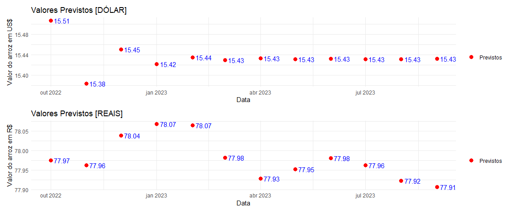<!-- -->
